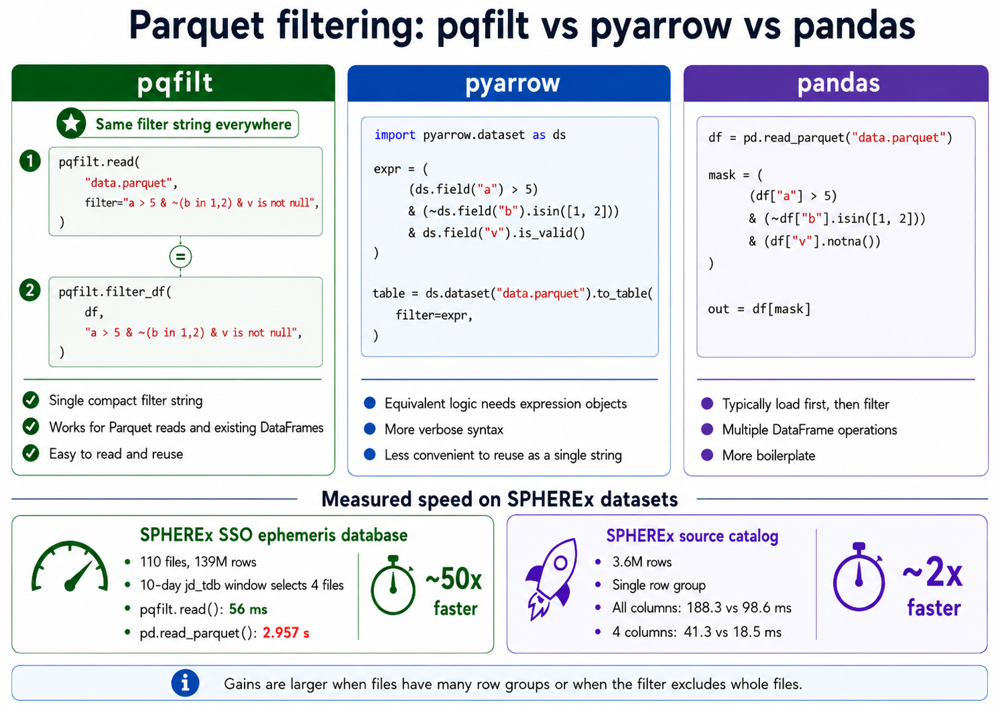

# pqfilt

Generic Parquet filtering tool (CLI and Python API).

[ReadtheDocs Documentation](https://pqfilt.readthedocs.io/en/latest/).

* Originally developed while dealing with large Parquet files in [SPHEREx mission](https://spherex.caltech.edu/) ([GitHub](https://github.com/SPHEREx)).

## Main Purpose
`pqfilt` wraps `pyarrow.dataset` to let you filter Parquet files **before** they
are fully read into memory, using row-group-level filtering. This is very efficient/fast.

An image generated by GPT 5.6:


* Using `pqfilt.read()` with filters is faster than `pd.read_parquet()` on the
  measured SPHEREx datasets.
  * **~50× faster** on the SPHEREx SSO ephemeris database (110 files, 139M
    rows; a 10-day `jd_tdb` window selects 4 files, 56 ms vs 2.957 s);
  * **~2× faster** on a 3.6M-row SPHEREx source catalog (single row
    group, compound filter, all/four columns). Gains are larger when files have
    many row groups or the filter excludes whole files.
* The syntax is designed to be intuitive and flexible
   * e.g., "a > 5 & ~(b in 1,2) & v is not null" is much simpler than the equivalent `pyarrow` expression syntax or chaining multiple DataFrame filters together.
* Even if you already loaded a DataFrame, you can use `pqfilt.filter_df(df, 'a > 5 & ~(b in 1,2) & v is not null')` to apply the same filter syntax to it.

## Installation

```bash
pip install pqfilt
# or
uv add pqfilt
```

## Python API

```python
import pqfilt

# Simple filter
df = pqfilt.read("data.parquet", filters="vmag < 20")

# AND + OR with expression syntax
df = pqfilt.read("data.parquet", filters="(a < 30 & b > 50) | c == 1")

# Negation with ~ prefix
df = pqfilt.read("data.parquet", filters="~(a > 5)")
df = pqfilt.read("data.parquet", filters="a > 5 & ~(b in 1,2,'1','2')")

# Null checks
df = pqfilt.read("data.parquet", filters="v is null")
df = pqfilt.read("data.parquet", filters="v is not null")

# Boolean columns
df = pqfilt.read("data.parquet", filters="is_comet == True")
df = pqfilt.read("data.parquet", filters="is_comet != false")

# Membership filter (explicit quotes preserve string types, e.g., to prevent Parquet type errors)
# Supported array formats: "val1, val2", "(val1, val2)", "[val1, val2]"
df = pqfilt.read("data.parquet", filters="desig in '1', '2', '3'")
df = pqfilt.read("data.parquet", filters="desig in ('1', '2', '3')")
df = pqfilt.read("data.parquet", filters="desig in ['1', '2', '3']")

# Tuple syntax (flat AND)
df = pqfilt.read("data.parquet", filters=[("a", "<", 30), ("b", ">", 50)])

# Tuple syntax with null checks
df = pqfilt.read("data.parquet", filters=[("v", "is null", None)])

# DNF syntax (OR of ANDs)
df = pqfilt.read("data.parquet", filters=[
    [("a", "<", 30)],
    [("b", ">", 50)],
])

# Column selection + output
df = pqfilt.read("data/*.parquet", columns=["a", "b"], output="out.parquet")

# Arrow scanner: materialize a table or consume record batches yourself
scanner = pqfilt.scan("data/*.parquet", filters="vmag < 20")
table = scanner.to_table()

# Out-of-core write: stream filtered batches directly to an output file
rows_written = pqfilt.write_filtered(
    "data/*.parquet",
    "filtered.parquet",
    filters="vmag < 20",
)

# Filter an already-loaded DataFrame (same syntax)
df = pd.read_csv("data.csv")
filtered = pqfilt.filter_df(df, "a > 5 & ~(b in 1,2) & v is not null")
```

## CLI

```bash
# Basic filter
pqfilt data/*.parquet -f "vmag < 20" -o filtered.parquet

# AND + OR expression
pqfilt data/*.parquet -f "(a < 30 & b > 50) | c == 1" -o filtered.parquet

# Multiple -f flags (AND-ed together)
pqfilt data/*.parquet -f "vmag < 20" -f "dec > 30" -o filtered.parquet

# Column selection
pqfilt data/*.parquet -f "vmag < 20" --columns vmag,ra,dec -o filtered.parquet

# Membership filter (enclosing brackets [] or () are automatically stripped)
pqfilt data/*.parquet -f "desig in [1, 2, 3]" -o filtered.parquet
```

### Column names with special characters

Columns containing operator characters can be backtick-quoted. Say you have a column named ``"alpha*360"``. Wrap it with backticks to avoid misinterpretation as a multiplication operator:

```python
pqfilt.read("data.parquet", filters="`alpha*360` > 100")
```

Word operators (``in``, ``not in``, ``is null``, and ``is not null``) must
be preceded by whitespace. This grammar rule keeps an unquoted column name
ending in ``in`` (such as ``spin`` or ``margin``) from being misread as an
operator. Symbolic operators do not have this requirement:

```python
pqfilt.read("data.parquet", filters="spin > 3")
pqfilt.read("data.parquet", filters="margin in 1,2")
```

## License

MIT
